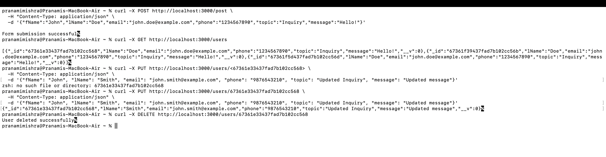

# Groceria

A web-based grocery delivery application that allows users to order groceries online. Built with **Node.js**, **Express**, and **MongoDB**, **HTML**, **CSS** this application provides a backend API for managing users, products, carts, and orders.

## Table of Contents
- [Features](#features)
- [Installation](#installation)
- [Usage](#usage)
- [Acknowledgments](#acknowledgments)

## Features
- User registration and authentication.
- Browse and search grocery products.
- Add products to the cart and place orders.
- Admin panel for managing products and viewing orders.

## Installation

1. **Clone the repository**:
   ```bash
   git clone https://github.com/parth2965/flexi-project
Navigate to the project directory:

bash
Copy code
cd grocery-delivery
Install dependencies:

bash
Copy code
npm install
Configure environment variables:

Create a .env file in the root directory and add the following:
plaintext
Copy code
MONGODB_URI=mongodb://localhost:27017/grocery
JWT_SECRET=your_jwt_secret
PORT=3000
Run MongoDB server:

bash
Copy code
mongod
Start the application:

bash
Copy code
npm start
Access the app at http://localhost:3000.
##Acknowledgment s

MongoDB - Database for storing product, user, and order information.
Express - Server framework for Node.js.
Postman - Used for API route testing during development.
Figma - Used for Initial Design of Website
https://www.figma.com/design/rc3YiPQcoMsZiRsifd41gD/groceria?node-id=0-1&t=LdsZYf3EwY8XQjHT-1

Usage
User Registration: Register a new user to create an account.
Login: Log in to access and manage your cart and place orders.



